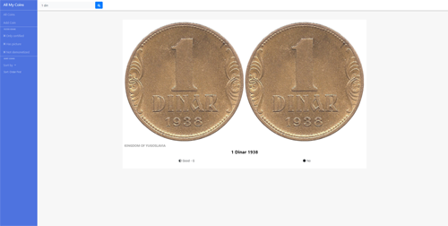
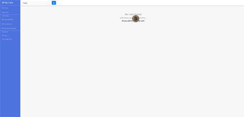
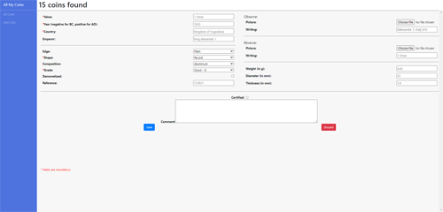
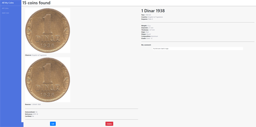
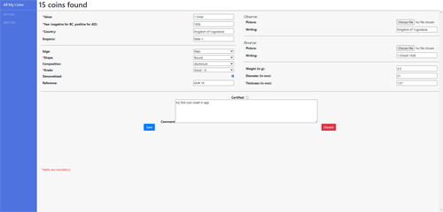

# AllMyCoins

*Angular, responsive, app made in my third year of studying.*

## Website Desing

### *Coin page*

Coin page for showing all coins with filtering.

### *404 page*

404 Not Found page.

### *No coin found page*

No coin found page, when filters do not return any coin.

### *Add coin page*

Page to add a new coin.

### *Single coin page*

Page for showing a single coin.

### *Edit coin page*

Page for edditing coins.