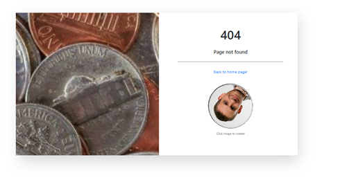

# AllMyCoins

*Angular, responsive, app made in my third year of studying.*

## Website Desing

### *Register page*

Register page.

### *Login page*

Login page.

### *Notes page*

Viewing all notes.

### *No notes page*

Page when no notes could be found.

### *Edit note page*

Page for editting a note.

### *Add note page*

Page for adding a note